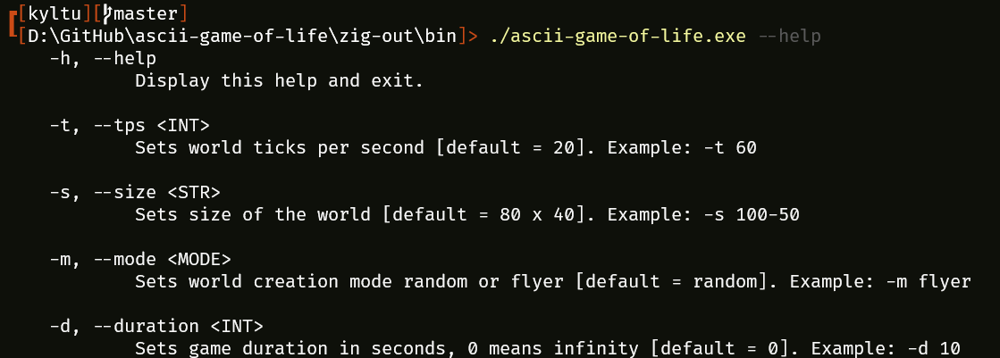

# Ascii game of life written in zig

A simple terminal implementation of [conway`s game of life](https://conwaylife.com/wiki/Conway%27s_Game_of_Life). Implemented in [zig lang](https://ziglang.org/), using [clap](https://github.com/Hejsil/zig-clap) for command line parsing.

Tested with zig version 0.13.0

# Download and build

For downloading you can clone this repo.

```
git clone https://github.com/Kiuh/ascii-game-of-life
```

Move to root project directory.

```
cd ascii-game-of-life
```

Then build and run game.

```
zig build run
```

# Run and test

To run application just execute it without arguments.

You can run `--help` to see run options.
This feature implemented with `clap` package.



# Visual example

<video controls src="graphic/example.mp4" title="Title"></video>
